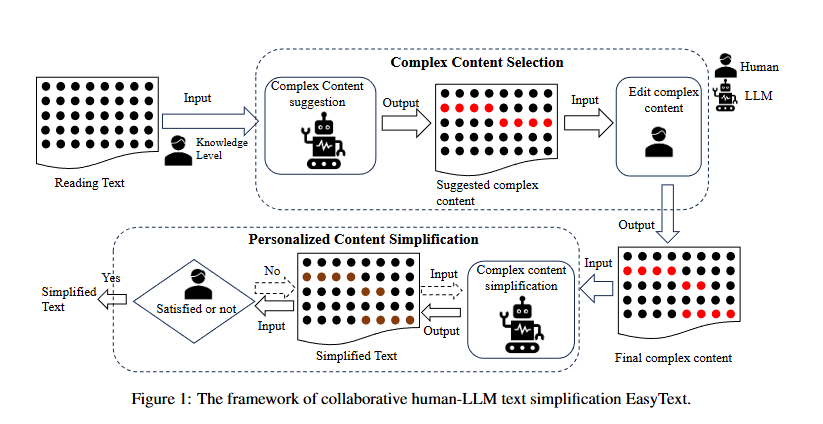
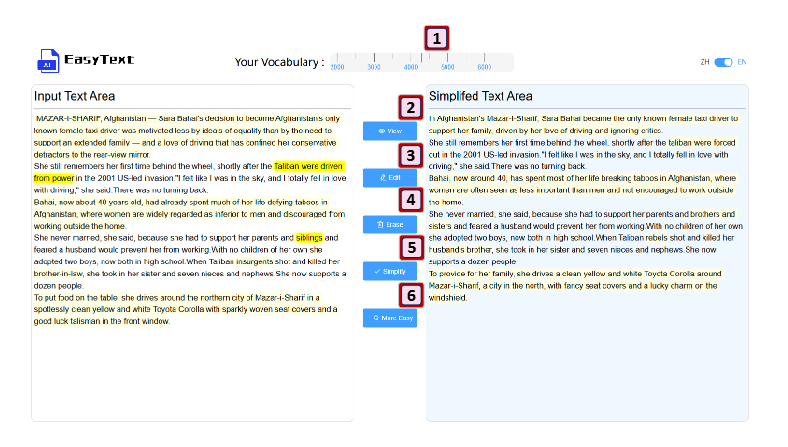

<h1 align="center">  Easyext </h1>

<!--
<h3 align="center">
    <p>A Framework for Multi-LLM Environment Simulation</p>
</h3>
-->

<!--
<p align="center">

</p>
-->

EasyText is a system designed for human-LLM cooperation in generating personalized simplified content according to user vocabulary range. EasyText incorporates user feedback at multiple stages. It allows users to input their self-assessed knowledge levels and review simplification suggestions, ensuring that the output is closely aligned with their comprehension abilities. EasyText achieves a better balance between
semantic faithfulness and reduced complexity tailored to individual needs.

<p align="center">

</p>
- Framwork : The framework is showed in Figure , which consists of two stages: (i) complex text selection via highlighting, and (ii) personalized text simplification according to selected content.

<p align="center">

</p>

- ScreenShot: Our EasyText web application. The original content inputed by the user is displayed on the left side of the
  system , and the simplified result through interaction is displayed on the right side. Users can change the vocabulary
  range at the top of the web application using a slider , then system’s suggestions and simplified results will then be
  tailored to the selected vocabulary [1]. Upon clicking the View icon , the system’s selection suggestions will be
  highlighted in light yellow on the left side of the application [2].Users select content with the mouse and then click
  the Edit icon to add a dark yellow highlight, making it visually distinct from the system’s suggestions [3]. Users
  select content with the mouse and click the Erase icon to remove the highlight [4]. Users interact with the system
  by operating context with adding highlighting and removing highlighting . After clicking the Simplify icon, the
  highlighted content is simplified and displayed on the right side of the system [5]. Simplified content is distinguished
  by a light yellow highlight.Users can use the remove highlighting function [4] to retain the highlighting effect of
  text that is still confusing after simplification. Click the More Easy icon and the system will further simplify the
  content that is still highlighted [6]

## 👾 Simple Demo Video

#### live demo website http://49.232.199.229:400/

### Note!

##### We recently updated EasyText to provide two more detailed interactive frontends, one is a questionnaire, which can be visited by registered users, but it does not require registration to experience it.

##### Another way is for users to judge the difficulty of four articles of different difficulty given by us, so as to get the user's ability level.

We will show the features of EasyText through a demo video.

[](https://youtu.be/JawQWmqrZVw?si=6FZ1qRGjfgHTvUTl)

# 🚀 Getting Started

## Installation

Easytext uses a front-end and back-end separation structure. We use the flask framework for the back-end.

** Back-end Install (Manually Recommended!)**

**Make sure you have Python >= 3.8**

```bash
pip install -r requirements.txt
```

**After installation, you need to fill in your own deepseek apikey="xxxx" in deepseek.py**

We will integrate more open LLMs and closed LLMs into EasyText in the future. Will upload after editing and this will not take long.

\*\*

**Font-end Install **

We provide a quick-to-use version that does not require the installation of any front-end scaffolding. The js resources required for the front-end have been uploaded and can be used with a single click.
